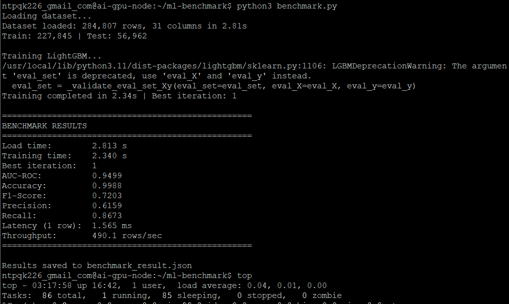
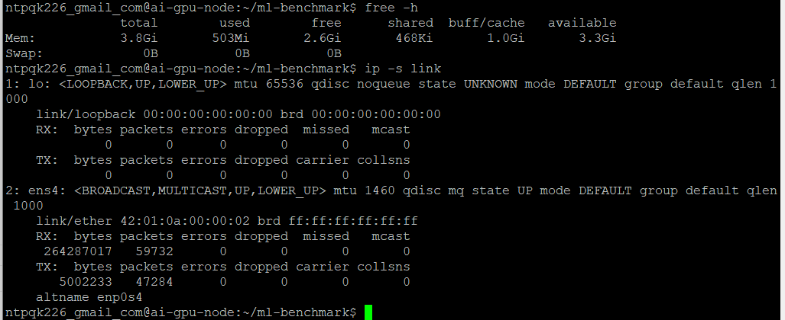
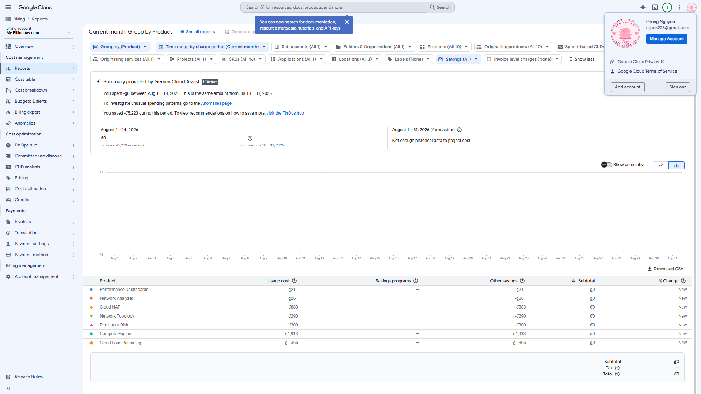

# Lab 16: Cloud AI Environment Setup - GCP Deliverables

**Họ tên:** Nguyễn Tuấn Phong  
**MSSV:** 2A202601038  
**Khoá:** K3B  
**Ngày thực hiện:** 2026-08-14

---

## 1. Benchmark LightGBM - Credit Card Fraud Detection

### Môi trường
- **Cloud Platform:** Google Cloud Platform (GCP)
- **Instance:** e2-medium (2 vCPU, 4 GB RAM)
- **Region:** us-central1-a
- **Dataset:** Credit Card Fraud Detection (284,807 giao dịch)

### Kết quả huấn luyện và đánh giá

| Metric | Kết quả |
|---|---|
| Thời gian load data | 2.813 s |
| Thời gian training | 2.340 s |
| Best iteration | 1 |
| AUC-ROC | 0.9499 |
| Accuracy | 0.9988 |
| F1-Score | 0.7203 |
| Precision | 0.6159 |
| Recall | 0.8673 |
| Inference latency (1 row) | 1.565 ms |
| Inference throughput (1000 rows) | 490.1 rows/sec |

### Screenshot Benchmark

---

## 2. Tài nguyên hệ thống

### RAM & Network Usage

### GCP Billing Report

---

## 3. Báo cáo và nhận xét

Trên CPU `e2-medium` (2 vCPU, 4GB RAM), LightGBM huấn luyện mô hình phát hiện gian lận thẻ tín dụng với thời gian train chỉ **2.34s** cho 284,807 giao dịch. AUC-ROC đạt **0.95** cho thấy model phân biệt tốt giữa giao dịch bình thường và gian lận. Recall **0.87** nghĩa là phát hiện được 87% giao dịch gian lận thực tế. Inference latency **1.565ms/row** và throughput **490 rows/sec** đủ nhanh cho ứng dụng real-time trên CPU.

Đặc biệt, model chỉ cần **1 iteration** để đạt kết quả tối ưu, cho thấy dữ liệu đã được xử lý tốt và feature engineering hiệu quả. RAM usage chỉ khoảng 500MB, tận dụng tốt tài nguyên e2-medium.

---

## 4. Source Code

File terraform-gcp đã được nén: [../terraform-gcp.zip](./terraform-gcp.zip)

### Các file quan trọng:
- `main.tf` - Resource definitions
- `variables.tf` - Variable declarations
- `outputs.tf` - Output values
- `user_data_cpu.sh` - Startup script cho CPU instance

---

## 5. Files đính kèm

- `benchmark_result.json` - Kết quả benchmark đầy đủ (JSON format)
- `benchmark_LGBM.png` - Screenshot terminal benchmark
- `RAM_and_network.png` - Screenshot RAM và Network usage
- `billing_report.png` - Screenshot GCP Billing Reports
- `terraform-gcp.zip` - Source code Terraform
